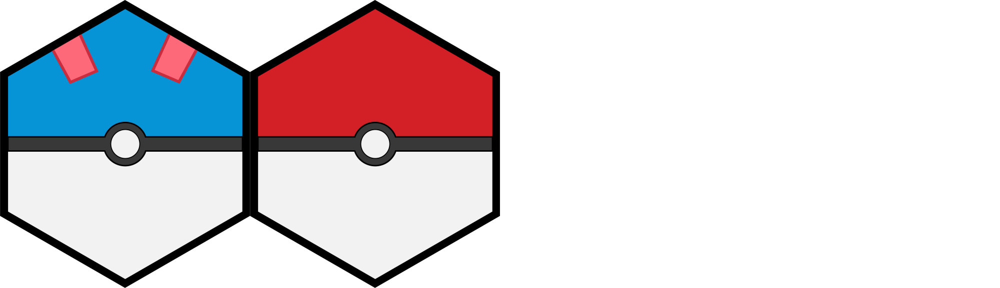

# Pokeball hexes

This is a small silly project with the goal of combing two interests of
mine (R package hex design + Pokémon), while practicing Illustrator.

All the hex logos as either [PNG](PNG/) or [SVG](SVG/).

All stickers are under with [CC0](LICENSE.md).
